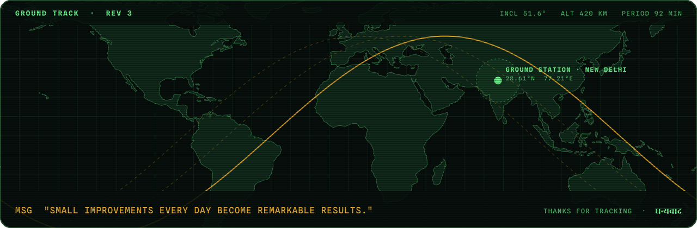

  
  
  
  

<h2 align="center">Mission patches</h2>

  
  
  
  

| Prog | Mission | Payload | Status |
| :-: | --- | --- | --- |
| **P01** | [**Monsoon Bahi-Khata**](https://github.com/tiwarinamit131-droid/monsoon-bahi-khata) · descriptive → prescriptive analytics for India's monsoon | TypeScript engine, Monte Carlo in a Web Worker, exact KKT optimiser, D3, 55 tests | 🟢 [live](https://tiwarinamit131-droid.github.io/monsoon-bahi-khata/) |
| **P02** | [**GeoShield**](https://github.com/tiwarinamit131-droid/Geoshield) · satellite change detection for illegal encroachment, checked against protected areas and permits | Sentinel-2 NDVI/NDWI, Turf.js, React, Leaflet, Python · Build with Bharat 2.0, Team Striders | 🟢 [live](https://geoshield-striders.netlify.app) |
| **P03** | [**Terminal portfolio**](https://github.com/tiwarinamit131-droid/tiwarinamit131-droid.github.io) · my portfolio is a command line | JavaScript, HTML, CSS · type `help` | 🟢 [live](https://tiwarinamit131-droid.github.io) |
| **P04** | [**Bachat**](https://github.com/tiwarinamit131-droid/FWD_BACHAT_FINAL) · group expense tracker that auto-splits shared costs | HTML, CSS, JavaScript · category analytics, Bachat Score, reminders | 🟡 code |

<b>Ground tests</b> · smaller builds

 

| Repo | What it is |
| --- | --- |
| [DLD-Verilog](https://github.com/tiwarinamit131-droid/DLD-Verilog) | Digital logic in Verilog: gates, multiplexers, encoders, latches and SR / D / JK / T / master-slave flip-flops |
| [fwd-project](https://github.com/tiwarinamit131-droid/fwd-project) | Responsive multi-page recipe site in plain HTML and CSS, with search |
| [JS-Assignment](https://github.com/tiwarinamit131-droid/JS-Assignment) | Number-theory problems in JavaScript, each with a time-complexity analysis |
| [Apollo-11](https://github.com/tiwarinamit131-droid/Apollo-11) | Fork of the original Apollo Guidance Computer source. The reason this page looks the way it does. |

 

<h2 align="center">Onboard systems</h2>

  

 

