  
  
  
  

<h2 align="center">Things I've built</h2>

  
  
  
  

  
    <a href="https://github.com/tiwarinamit131-droid/monsoon-bahi-khata">monsoon source</a> ·
    <a href="https://github.com/tiwarinamit131-droid/Geoshield">geoshield source</a> ·
    <a href="https://github.com/tiwarinamit131-droid/tiwarinamit131-droid.github.io">portfolio source</a> ·
    <a href="https://github.com/tiwarinamit131-droid/FWD_BACHAT_FINAL">bachat source</a>
  

<b>More from the workbench</b>

 

| Repo | What it is |
| --- | --- |
| [DLD-Verilog](https://github.com/tiwarinamit131-droid/DLD-Verilog) | Digital logic in Verilog: gates, multiplexers, encoders, latches and SR / D / JK / T / master-slave flip-flops |
| [fwd-project](https://github.com/tiwarinamit131-droid/fwd-project) | Responsive multi-page recipe site in plain HTML and CSS, with search |
| [JS-Assignment](https://github.com/tiwarinamit131-droid/JS-Assignment) | Number-theory problems in JavaScript, each with a time-complexity analysis |

<h2 align="center">Toolbox</h2>

  

<h2 align="center">Every square is a day of building</h2>

  <picture>
    <source media="(prefers-color-scheme: dark)" srcset="https://raw.githubusercontent.com/tiwarinamit131-droid/tiwarinamit131-droid/output/snake-dark.svg">
    <source media="(prefers-color-scheme: light)" srcset="https://raw.githubusercontent.com/tiwarinamit131-droid/tiwarinamit131-droid/output/snake-light.svg">
    
  </picture>

<h2 align="center">2026 roadmap</h2>

  
  
  
  
  

